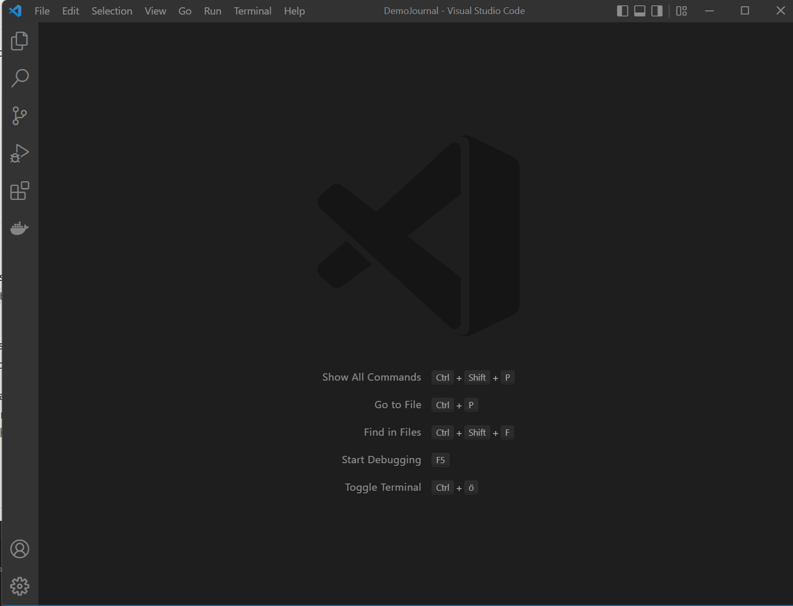

<table>
<tr>
<td>

</td>
<td>
<h1>
vscode-journal 
</h1>
Lightweight Extension for Visual Studio Code to take track of your daily notes. 
</td>
</tr>
</table>

 

## What is this extension about?
This extension is useful for people like me, who use simple text files for notes, task lists, and everything else which has to be remembered and searched for. Text (or Markdown) in files is easy to backup, sync and can be opened anywhere by everything. This extension has the following functions: 

* Open or create a journal entries for a specific day ([details and videos](./docs/entries.md))
* Add detailed notes for today ([details and videos](./docs/notes.md))
* Add a memo to today's journal page ([details and videos](./docs/memo.md))
* Manage your tasks ([details and videos](./docs/tasks.md))
* Print commands and snippets to support various tasks ([details and videos](./docs/print.md))
* Configure scopes to manage notes of different projects ([details](./docs/scopes.md))
* Use code actions to work on your task lists ([details](./docs/codeactions.md))

## Features
Press `Ctrl+Shift+J` to open the journal's smart input and start typing right away. Press `F1` or `Ctrl+Shift+P` to access one of the  commands. All supported commands are described [here](./docs/commands.md). 

The notes are stored in a folder on your desktop using the following structure (taking ZIM Desktop wiki as inspiration: `year/month/day.md`, the notes files for October 22th would be `../2016/10/22.md`. Detailed notes (e.g. meeting notes) are placed in the subfolder `../2016/10/22/some-meeting-notes.md`.

## Contributing
I am always looking for feedback, new ideas and your help. Check the [contribution guidelines](./CONTRIBUTING.md)

## Suggested extensions
vscode-journal is mainly responsible for organizing your notes and journal entries, it does not come with any user interface (besides the smart input). If you prefer tree like views for your notes and tasks, have a look at the following extensions by Gruntfuggly and Kortina

* [vscode-journal-view](https://marketplace.visualstudio.com/items?itemName=Gruntfuggly.vscode-journal-view) to easly navigate to your entries and notes by date
* [todo-tree](https://marketplace.visualstudio.com/items?itemName=Gruntfuggly.todo-tree) to quickly access and manage your tasks
* [markdown notes](https://marketplace.visualstudio.com/items?itemName=kortina.vscode-markdown-notes) for enhanced navigation capabilities between your notes

## Settings
Settings are described in detail [here](./docs/settings.md)

You have to set the base folder for notes folder structure before you start. Open your settings, search for 'journal' and copy the journal.base line into your personal settings. Adjust the value, for example: ` "journal.base": "C:/Users/FooBar/Documents/Journal"` (use forward slash!)

The default file format is Markdown (using `md` as extension), which is natively supported by Visual Studio Code. I use Asciidoc for my notes (with `.adoc` as extension), in this case you should also install an Asciidoc Syntax extension. 

Syntax highlighting is configured in your workspace settings. The options are stored automatically in the settings, you can then manually change them. Make sure to restart to apply the changes. The settings try to recognize if a dark or light theme is used. If you switch in between, you either have to delete the settings (to reload them from the extension) or adapt them for yourself. 

## Demo

