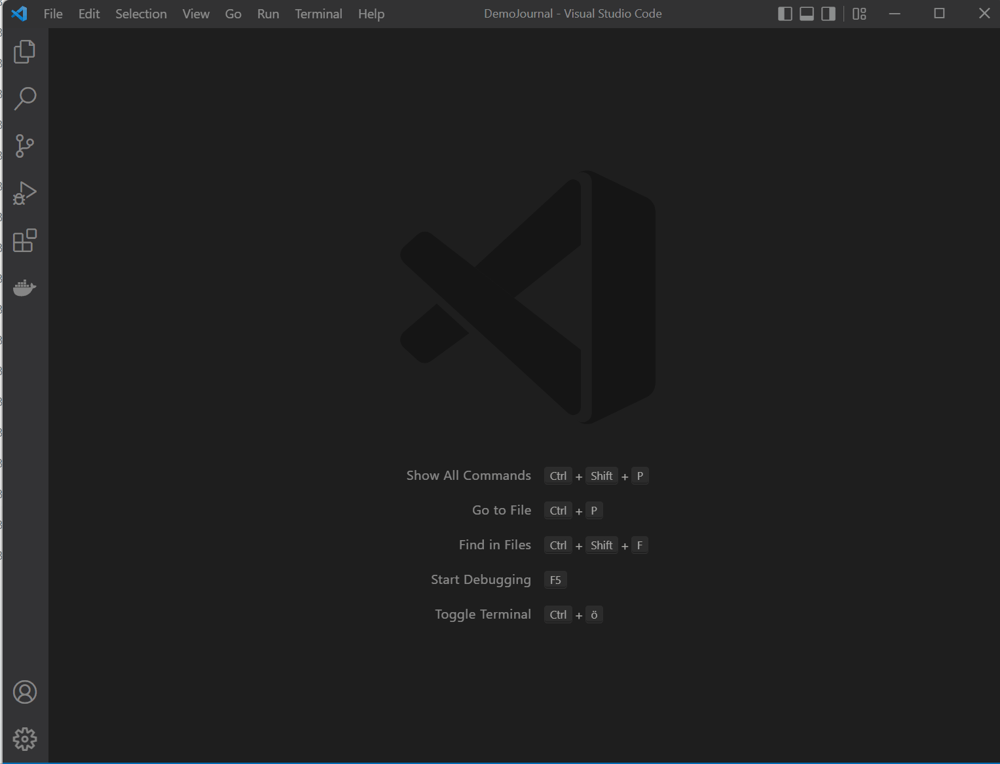

# Code Actions

Code actions are a Visual Studio Code feature (and basically every serious other IDE) to quickly run a commands from within the text. For now, the journal extension has code extension active for tasks. When you place your mouse cursor on a line with a task (any line starting with `- []` or `-[x]`), a yellow balloon will appear. You can trigger the selection of code actions by selecting the balloon or using the shortcut `CTRL+.` 

The following actions are supported for now
* Complete a task (marks the task and adds the completion time)
* Reopen a task
* Migrate a task to today (when current entry is from another day). It will modify the task to  `[>]` (inspired by bullet journaling) and append the new date 
* Migrate a task to tomorrow
* Migrate a task to the next working day (if tomorrow is in the weekend)

