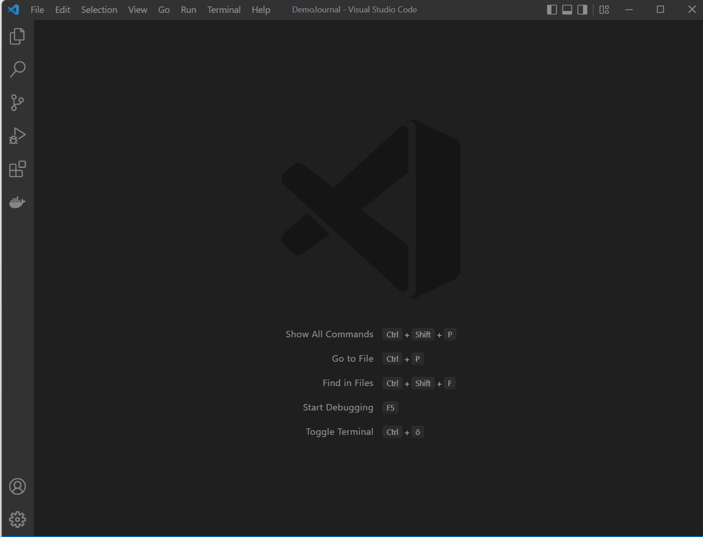

# Navigating to journal entries

A journal entry is created for every day. It collects the day's tasks, memos and any other content which you don't want to have in separate notes. I use it personally mostly for time tracking.  

A wide range of different inputs is supported, see [this page](./smartInput.md) for more details. 

