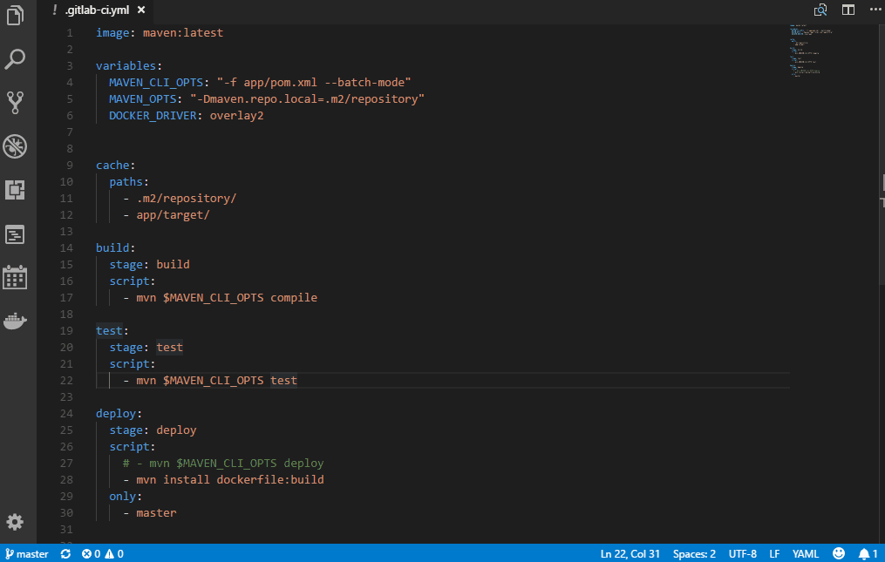

# Working with memos

Memos are simple reminders within your journal entries. You add memos through the smart input (Ctrl+Shift+J). Just enter any text, it will be added to your today's entry. By adding date modifiers, you can control in which journal entry the memo is inserted. 

* `+1 I have to remember this` adds a memo to tomorrow's journal entry
* `Check out Tom's presentation` adds a memo to today's journal entry
* `Next wednesday call my bank` adds the memo "Call my bank" to next wednesday's journal entry

