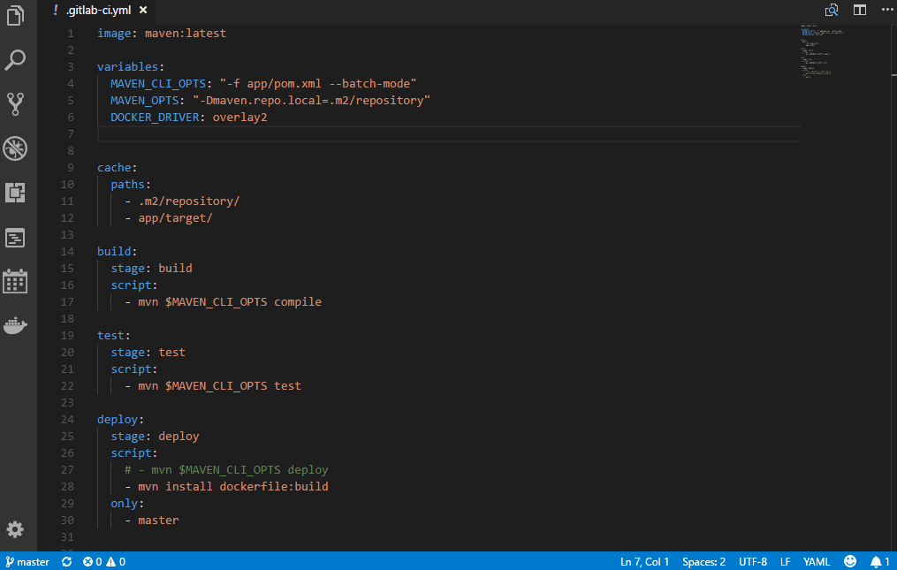

# Working with notes

Notes are single markdown files linked to the today's journal entry. `journal:note` (in the command palette using the shortcut `Ctrl+Shift+P`) opens a dialog to enter the title of a new page for notes. The title is also the filename (stored typically as subfolder in the journal structure, e.g. folder ´25´ in folder ´10´ if today is 10/25).  Local links are automatically added to the current day's journal entry.

You can also use the journal's smart input to create a note. Press `Ctrl+Shift+J`, pick "Select/Create a note" and enter the title.

Notes are automatically linked in the according journal entry (of the same day, when the note has been created).

## Support for Scopes
You can add a scope tag to the note title to store the note in a project-specific location.

If you enter something like "#projectA Workshop Minutes" as title, the new document is stored in the scope `projectA` (by default the folder `scopes/projectA`) instead of the date folders, and today's entry links to it. Create scopes with **Journal: Create Scope**, see [Scopes](./scopes.md).

---

→ [Commands](./commands.md) · [Settings](./settings.md)
