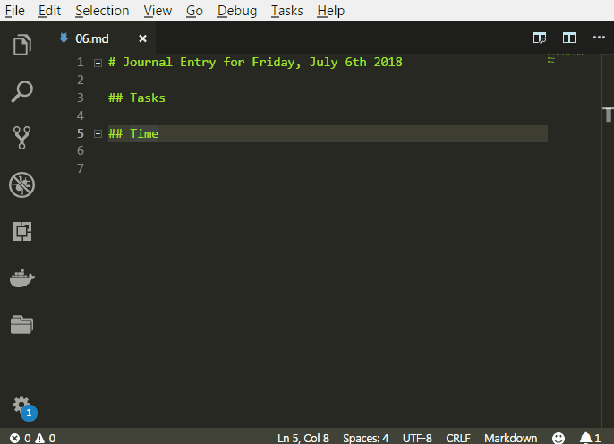

# Working with print commands and snippets

I use the journal daily to track my time spent on various projects. You can use the following commands (and shortcuts) to compute the duration between two timestamps or to print the sum of various numbers. 

* `Print Time` to enter timestamps at cursor position. 
* `Print elapased hours`, which computes the duration between two seleced timestamps (same format as what "Insert time" prints). Shortcut: `Ctrl+J Ctrl+D`
* `Print sum of selected numbers`, which summarizes all selected numbers (I use it to compute the total time). Shortcut: `Ctrl+J Ctrl+S`v