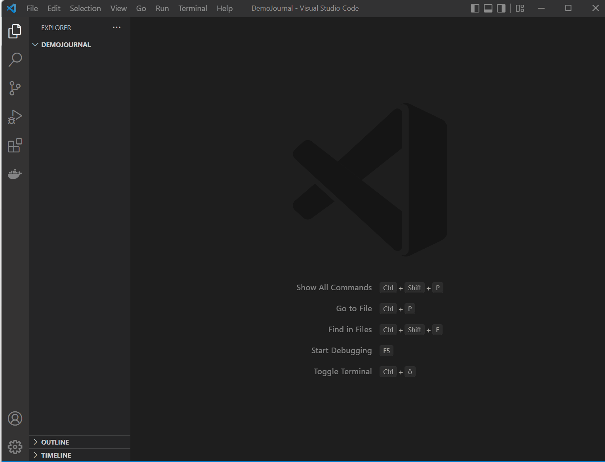

# Scopes

Scopes help you to manage notes within your different projects by declaring individual configurations. Scopes are specific tags such as "#clientA" or "#private". When creating a new note and using that tag in the input box, you tell the extension to use the scope's configuration (and not the global configuration of the journal). 

## Setting up a new scope
Let's stick to the example of the new scope "#clientA", which you plan to use to store all notes in a new project coming up with a Client. 

### Configure Settings
Open your settings and adapt ```journal.scopes``` directly in settings.json. 

Visual Studio Code will generate the following snippet for you: 

```json
  "journal.scopes":  {
  }

```
You have to replace the curly brackets with ```[]```, since we expect an array here (a list of scopes). 

Within a scopes definition, you can reconfigure the base path and the file patterns (only notes so far, see below). The following example sets up new scopes for "clientA" and "private". The Notes-Folder for ClientA points to a Git Repository shared with my Team, while the private Folder is part of my normal base path (but notes are not stored under the journal entries). 


```json
  "journal.scopes":  [
        
        {
            "name": "clientA", 
            "patterns": {
              "base": "D:/Repositories/ClientA/SharedNotes", 
              "notes": {
                "path": "${base}/userX",
                "file": "${d: YYYYY-DD-MM}-${input}.${ext}"
              }, 
            }
        }, 
        {
            "name": "private", 
            "patterns": {
              "notes": {
                "path": "${base}/scopes/private",
                "file": "${localDate}-${input}.${ext}"
              }, 
            }
        }
 ]
```


### Scoped Journal Entries
Supporting scopes for journal entries messes with the input box and would require some serious rewriting of the pattern matching code. Please open an issue if you want this feature. 


## Using scopes

Whenever you want to create a new note, just prefix the note's title with the scope, written as tag. 

1. Press ```Ctrl+Shift+J```
2. Pick "Select or create note"
3. Enter the scope and some text, for example ```#clientA Sprint Daily Notes```

The details for the highlighted item in picklist should tell you, if the scope has been detected and should look like
```Create new note in scope #clientA and tags #clientA```. Any other tags you enter here will be pasted in the new file. 


