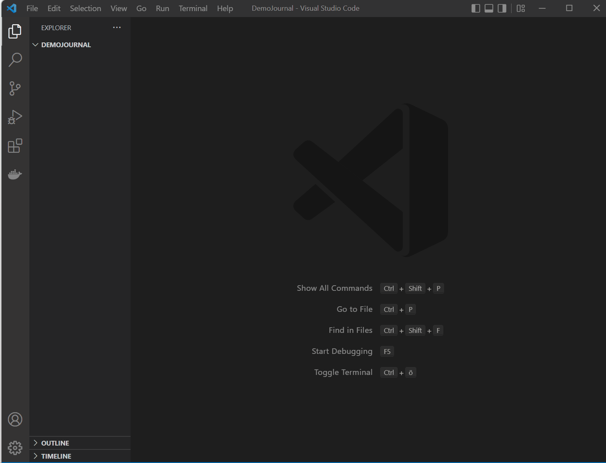

# Scopes

Scopes help you organise notes by project or topic. A scope is a tag such as `#clientA` or `#vera`: when you start a note title with the tag, the note is stored in the scope instead of the date folders of the journal, and today's journal entry links to it.

## Creating a scope

Run **Journal: Create Scope** from the command palette and enter a name (letters, digits, `_` and `-`). The extension creates the folder `scopes/<name>` below your journal base (with an empty `.gitkeep`, so that git keeps the empty folder).

Every folder below the scope root is a scope — you can also create the folders yourself, e.g. with your file manager. The scope root is configured with `journal.scopeRoot` (default `${base}/scopes`; relative paths are relative to `journal.base`).

## Creating notes in a scope

1. Press `Ctrl+Shift+J` and pick "Select/Create a note", or run **Journal: New Journal Note**.
2. Enter the scope tag and the title, e.g. `#clientA Sprint Daily Notes`. Further tags (e.g. `#draft`) are written into the note.

The picker shows "Create new note in scope "clientA" …" when the scope has been detected. The note is created as `scopes/clientA/Sprint_Daily_Notes.md` from the `note` template, and a link (`files` template, by default `- NOTE: [Sprint Daily Notes](../../scopes/clientA/Sprint_Daily_Notes.md)` below `## Notes`) is added to today's journal entry.

Notes in folder scopes are linked once, when they are created. Editing them later does not add further links.



## Configuring scopes

`journal.scopes` (an array) adds scopes or changes how a scope stores its notes. An entry with the same name as a scope folder overrides that folder scope.

```json
"journal.scopes": [
    {
        "name": "clientA",
        "base": "D:/Repositories/ClientA/SharedNotes",
        "patterns": {
            "notes": {
                "path": "${base}/userX",
                "file": "${d:YYYY-MM-DD}-${input}.${ext}"
            }
        }
    },
    {
        "name": "meetings",
        "patterns": {
            "notes": {
                "path": "${base}/scopes/meetings/${year}",
                "file": "${localDate}-${input}.${ext}"
            }
        },
        "templates": [
            { "name": "note", "template": "# ${input}\n\n${tags}\n\n## Participants\n\n## Minutes\n" }
        ]
    }
]
```

* `name` — the tag without `#`.
* `base` — replaces `${base}` in the scope's patterns. It sits at the top level of the scope, **not** inside `patterns`. Without it, the journal base is used.
* `patterns.notes` — where notes of the scope are stored. Without it, notes of a folder scope go into the folder; scopes that only exist in the settings use the global `journal.patterns.notes`.
* `templates` — scope-specific templates (same format as `journal.templates`), e.g. a different `note` template.

Links to scoped notes always go into the main journal entry of the day, even when the scope has its own base.

### Scoped journal entries
Supporting scopes for journal entries messes with the input box and would require some serious rewriting of the pattern matching code. Please open an issue if you want this feature.

## MCP server

The [MCP server](../mcp-server/README.md) resolves scopes the same way and offers tools to list and create scopes and to create, read and extend scoped notes.

---

→ [Commands](./commands.md) · [Settings](./settings.md)
