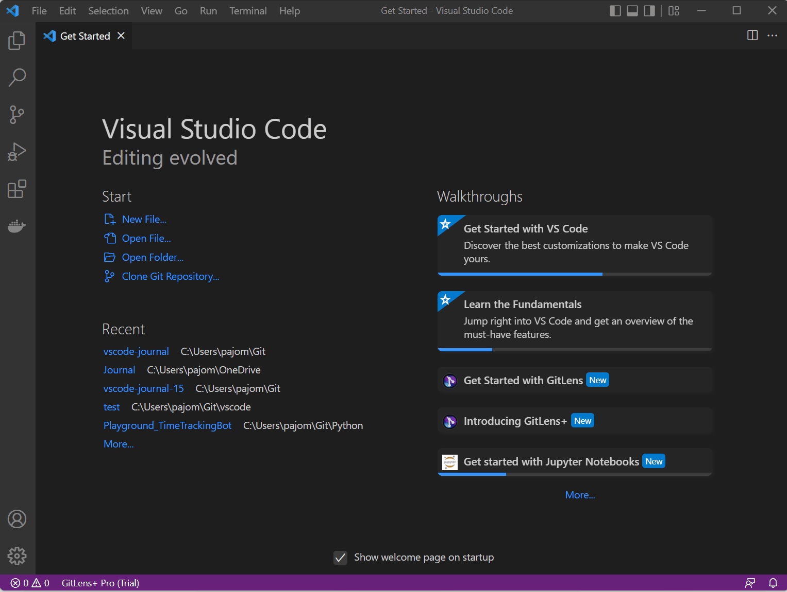

# Journal Configuration

Many parameters of the journal can be configured through the internal settings of Visual Studio Code. See [this page](https://code.visualstudio.com/docs/getstarted/settings) for a general introduction.

The only mandatory setting is the base path. See the bottom of this page for a screen capture showing how to change it.

Before you change a setting, think about whether you want to store it in your user settings or workspace settings.
* If your current workspace is synced across different devices and you want the setting to be used on different machines (e.g. syntax highlighting and templates), put the options into your workspace settings.
* If the settings are specific to your environment (e.g. directories), put them into your user settings (which are stored in your local user profile).

## Workspace and virtual workspace support

vscode-journal writes files to the directory configured in `journal.base`. In an **untrusted workspace** `journal.base` workspace-level overrides are ignored — the user-level value is used instead, so workspace settings cannot redirect your journal to an untrusted path.

In a **virtual workspace** (e.g. GitHub Codespaces or Remote SSH with a virtual FS provider), write operations to local paths are unavailable. Read-only browsing of existing entries may still work, but creating new entries or notes requires a local workspace.

## Template variables

Some settings support the following variables:

* `${homeDir}` — the current user's home directory via Node's `os.homedir()`. Resolves to `$HOME` on Linux / Mac and `%USERPROFILE%` on Windows.
* `${input}` — a string entered by the user in the smart input dialog.
* `${year}` — current year as a four-digit number.
* `${month}` — current month as a two-digit number.
* `${day}` — current day as a two-digit number.
* `${week}` — current ISO week number (1–53).
* `${weekday}` — name of the current day of the week.
* `${localDate}` — locale-formatted date (e.g. `September 4, 1986`).
* `${localTime}` — locale-formatted time (e.g. `8:30 PM`).
* `${d:...}` — custom date format using [Moment.js display format](https://momentjs.com/docs/#/displaying/format/), for example `${d:dddd, MMMM Do YYYY}`.


## Directories

### Base directory

* Key: `journal.base`
* Default: directory `Journal` in the current user's home directory (`${homeDir}/Journal`).
* Supported variables: `${homeDir}`

`${homeDir}` resolves to `$HOME` on Linux and Mac and to `%USERPROFILE%` on Windows. Example:

```json
"journal.base": "${homeDir}/Documents/Journal"
```

Note: in an untrusted workspace, any workspace-level override of `journal.base` is ignored; the user-level value is always used (see "Workspace and virtual workspace support" above).

### Path Patterns for notes and journal entries

* Key: `journal.patterns`
* Supported variables: `${base}`, `${year}`, `${month}`, `${day}`, `${week}`, `${input}`, `${ext}`

The location of all files created within the base directory are configured using individual patterns:

```json
"journal.patterns": {
    "notes": {
        "path": "${base}/${year}/${month}/${day}",
        "file": "${input}.${ext}"
    },
    "entries": {
        "path": "${base}/${year}/${month}",
        "file": "${day}.${ext}"
    },
    "weeks": {
        "path": "${base}/${year}",
        "file": "week_${week}.${ext}"
    },
    "weeklyNotes": {
        "path": "${base}/${year}/w${week}",
        "file": "${input}.${ext}"
    }
}
```

| Pattern key | Used when |
|---|---|
| `notes` | Creating a note with `journal.note` (daily granularity) |
| `entries` | Creating or opening a daily journal entry |
| `weeks` | Creating or opening a weekly journal entry |
| `weeklyNotes` | Creating a note with `journal.note` when `journal.entryGranularity = "weekly"` |

This configuration is only valid for the default scope. Scoped notes use scope-specific patterns if configured (see [Scopes](./scopes.md)).


## Templates

Templates configure how text within generated files is formatted.

* Key: `journal.templates`

The default is:

```json
"journal.templates": [
    {
        "name": "memo",
        "template": "- MEMO ${localTime}: ${input}"
    },
    {
        "name": "task",
        "template": "- [] ${d:LL} - Task: ${input}",
        "after": "## Tasks"
    },
    {
        "name": "entry",
        "template": "# ${d:dddd, MMMM DD YYYY}\n\n## Tasks\n\n## Notes\n\n"
    },
    {
        "name": "time",
        "template": "${localTime}"
    },
    {
        "name": "note",
        "template": "# ${input}\n\n${tags}\n"
    },
    {
        "name": "files",
        "template": "- NOTE: [${title}](${link})",
        "after": "## Notes"
    },
    {
        "name": "weekly",
        "template": "# Week ${week}\n\n## Tasks\n\n## Notes\n\n## Daily Entries\n\n"
    },
    {
        "name": "dailyLink",
        "template": "- [${weekday}, ${d:MMMM DD}](${link})",
        "after": "## Daily Entries"
    }
]
```

Each entry has:
* `name` — identifier used internally and in `journal.tpl-*` legacy keys.
* `template` — the string to insert. Supports all template variables listed above.
* `after` (optional) — heading string after which new content is inserted. Must match the heading exactly as it appears in the file.

### Template Entries

* Key: `journal.templates["entry"].template`
* Supported variables: `${year}`, `${month}`, `${day}`, `${ext}`, `${weekday}`, `${localDate}`, `${localTime}`, `${d:}` (custom)

The default entry template generates:

```markdown
# Tuesday, September 25, 2018

## Tasks

## Notes
```

To add a new `## Memos` section, override both `memo` and `entry`:

```json
"journal.templates": [
    {
        "name": "memo",
        "template": "- Memo: ${input} (created: ${localTime})",
        "after": "## Memos"
    },
    {
        "name": "entry",
        "template": "# ${d:dddd, MMMM DD YYYY}\n\n## Tasks\n\n## Memos\n\n## Notes\n\n"
    }
]
```

Make sure the value in `after` matches the generated heading in the entry template exactly.

### Notes

* Key: `journal.templates["note"].template`
* Supported variables: `${input}`, `${year}`, `${month}`, `${day}`, `${weekday}`, `${localDate}`, `${localTime}`, `${d:}` (custom)

### Memos

* Key: `journal.templates["memo"].template`
* Supported variables: `${input}`, `${year}`, `${month}`, `${day}`, `${weekday}`, `${localDate}`, `${localTime}`, `${d:}` (custom)

---

* Key: `journal.templates["memo"].after`
* Default: none (inserts at the top of the entry)

The `after` flag tells the extension where to place the new line in an existing entry. It searches for the configured string and inserts the new content directly after it.

### Tasks

* Key: `journal.templates["task"].template`
* Supported variables: `${input}`, `${year}`, `${month}`, `${day}`, `${weekday}`, `${localDate}`, `${localTime}`, `${d:}` (custom)

---

* Key: `journal.templates["task"].after`
* Default: `## Tasks`

### File Links

* Key: `journal.templates["files"].template`
* Default: `- NOTE: [${title}](${link})`
* Supported variables:
  * `${title}` — title of the linked file (extracted from the file name)
  * `${link}` — relative path to the file

---

* Key: `journal.templates["files"].after`
* Default: `## Notes`

### Weekly entries

* Key: `journal.templates["weekly"].template`

The default weekly template includes a `## Daily Entries` heading, which is used by the [weekly sync](#weekly-sync) feature to maintain an automatic list of links to daily entries. See [Weekly Entries](./weekly-entries.md) for the full workflow.

### Daily links (weekly sync)

* Key: `journal.templates["dailyLink"].template`
* Default: `- [${weekday}, ${d:MMMM DD}](${link})`
* `after`: `## Daily Entries`

Used by the weekly sync to render each daily-entry link inside the `## Daily Entries` block.

## Legacy template keys

The following individual keys predate the unified `journal.templates` array. Both mechanisms are supported, but `journal.templates` is preferred for new or updated configuration.

| Key | Purpose |
|-----|---------|
| `journal.tpl-entry` | Template string for daily journal entries |
| `journal.tpl-time` | Template string for inserting the current time |
| `journal.tpl-note` | Template string for notes |
| `journal.tpl-memo` | Template string for new memos |
| `journal.tpl-memo-after` | Heading after which memos are inserted |
| `journal.tpl-task` | Template string for new tasks |
| `journal.tpl-task-after` | Heading after which tasks are inserted |
| `journal.tpl-todo` | Template string for new todos |
| `journal.tpl-todo-after` | Heading after which todos are inserted |
| `journal.tpl-files` | Template for file links injected into entries |
| `journal.tpl-files-after` | Heading after which file links are inserted |

**Migration:** Move the value from `journal.tpl-memo` into the `template` field of the `"memo"` entry in `journal.templates`, and do the same for other keys. Example:

```json
// Before (legacy)
"journal.tpl-memo": "- MEMO: ${input}",
"journal.tpl-memo-after": "## Memos"

// After (preferred)
"journal.templates": [
    { "name": "memo", "template": "- MEMO: ${input}", "after": "## Memos" }
]
```

Both can coexist; `journal.templates` takes precedence for any name that appears in both.


## Syntax highlighting

* Key: `journal.syntax-highlighting`
* Default: `false`

When enabled, the extension registers extension-specific syntax highlighting rules for journal markdown files. On the first activation, color token customizations are written into your user settings automatically. The settings are only written if they are not already present — existing customizations are never overwritten.

If you switch between light and dark themes, delete the journal color customizations from your user settings. They will be re-inserted with the appropriate colors on the next VS Code start.


## Scopes

* Key: `journal.scopes`
* Default: none
* Supported variables: see individual keys

Scopes allow adapting nearly all configuration patterns for configured tags. By entering a scoped tag in the smart input (for entries as well as for notes), the extension uses the scope-specific configuration instead of the default settings.

See more details [here](./scopes.md).


## Other options

### File extension

* Key: `journal.ext`
* Default: `md` (Markdown)
* Supported variables: none

### Locale

*Deprecated — the extension falls back to the display locale configured in your editor.*

* Key: `journal.locale`
* Default: `en-US`
* Supported variables: none

### Development mode

* Key: `journal.dev`
* Default: `false`
* Supported variables: none

Enables verbose logging in the Output channel. Useful for diagnosing unexpected behavior. In some versions it may also activate experimental features.

### Split Pane Mode

* Key: `journal.openInNewEditorGroup`
* Default: `false`
* Supported variables: none

Controls whether new files open in full mode or in a new editor group (split pane).

### Navigation Mode

* Key: `journal.navigation.mode`
* Default: `existing`
* Allowed values: `existing`, `calendar`

Controls how the `Open Previous Journal Entry` (`Ctrl+J ,`) and `Open Next Journal Entry` (`Ctrl+J .`) commands step through entries.

| Value | Behavior |
|-------|----------|
| `existing` *(default)* | Find the previous / next entry that already exists on disk. Skips gaps (weekends, vacations). At the start or end of history an info toast is shown and the editor does not change. |
| `calendar` | Step exactly one calendar day back or forward from the anchor file. Creates the target entry if missing (same as `Open Yesterday` / `Open Tomorrow`). |

The anchor is the currently open journal entry. When no journal file is open, the anchor falls back to today. Navigation honors the active scope — derived from the anchor file's path or the default scope when no anchor file is open.

### Entry Granularity

* Key: `journal.entryGranularity`
* Default: `daily`
* Allowed values: `daily`, `weekly`

Controls where quick memos, tasks, and new notes go when you have not typed an explicit date target into the smart input.

| Value | Behavior |
|-------|----------|
| `daily` *(default)* | Memos / tasks inject into today's daily entry; new notes land under `journal.patterns.notes`. |
| `weekly` | Memos / tasks inject into the current ISO week's weekly entry; new notes land under `journal.patterns.weeklyNotes`. |

Explicit date input always overrides this setting. `+0 task ...` still goes to today, `2026-05-13 memo: ...` still goes to that date, `w20 task ...` still goes to week 20.

When you switch to `weekly`, make sure the `journal.templates` entry named `weekly` includes the `## Tasks` and `## Notes` section headings — the default template already does this.

Known limitations:
- Granularity is a global setting in this release. Per-scope override is not yet supported.
- Switching granularity does not move files already on disk; both layouts can coexist.

### Weekly Sync

* Key: `journal.weeklySync`
* Default: `{ "enabled": true, "anchor": "## Daily Entries", "template": "- [${weekday}, ${d:MMMM DD}](${link})", "sortOrder": "ascending" }`

When a weekly entry is the active editor, the extension automatically maintains a list of links to every daily entry that exists within the same ISO week, keeping the block up to date as daily files are created or deleted.

| Field | Default | Description |
|-------|---------|-------------|
| `enabled` | `true` | Set to `false` to disable the feature entirely — no edits, no watcher. |
| `anchor` | `## Daily Entries` | The exact heading line the sync searches for. Add this heading to your weekly template if you customized it. Files without the anchor are left untouched. |
| `template` | `- [${weekday}, ${d:MMMM DD}](${link})` | Template for each link line. Supports `${weekday}`, `${d:...}`, `${link}`, `${title}`. |
| `sortOrder` | `ascending` | `ascending` = Monday → Sunday. `descending` = Sunday → Monday. |

The default `weekly` template ships with the `## Daily Entries` heading. If you have customized your weekly template and want to opt in, add `## Daily Entries` as a separate section heading. Weekly files without the anchor are silently skipped.

→ See [Weekly Entries](./weekly-entries.md) for the full weekly workflow.


