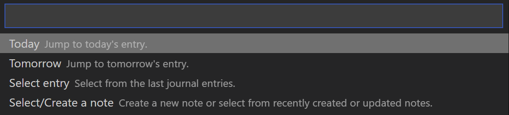
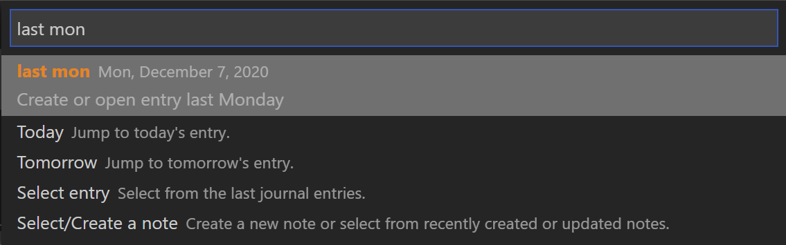
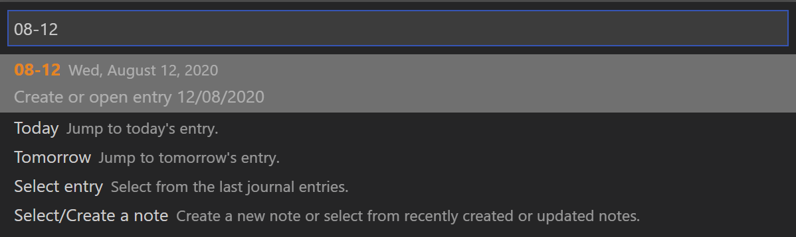

# Examples how to use the smart input

Using the shortcut ```CTRL+SHIFT+J``` to opens the following dialog. 



From there you can either start typing away (see below for options) or select one of the following options: 

* *Today* selects or creates the journal entry of the today 
* *Tomorrow* selects or creates the journal entry of the tomorrow 
* *Select entry* opens a list of existing journal entries
* *Select/Create a note* opens a list of existing notes for selection. You are still able to create a new note by simply typing the note title. 

This guide including its examples assume english as your display language. If you changed the setting **Display Language** in Visual Studio Code, you probably see other messages. Supported languages for this extension are: 

* English (en)
* German (de)
* French (fr)
* Spanish (es)
* Italian (it)
* Portuguese (pt)
* Dutch (nl)
* Russian (ru)
* Chinese (Pinyin) (zh)
* Japanese (Romaji) (ja)
* Arabic (ar)


## Supported input options
The help text in the dialog will tell you, what action will be performed after analyzing the input. 

The following actions are possible: 
* Pick a specific journal entry by entering a shortcut, offset, weekday or specific date
* Open a week's entry (last, this, and next, or a numbered calendar week)
* Add a memo to today's page or to a page of a specific date
* Add a task to today's page or to a page of a specific date


### Pick journal entry by shortcut


Supported shortcuts are
 
 * `today, tod` for today's journal entry
 * `tomorrow, tom` for tomorrow's journal entry
 * `yesterday, yes` for yesterday's journal entry

 Each entry will also create the entry if it doesn't exist yet. 


### Pick journal entry by offset


* ``` 0 ``` to select today's entry. Or simply press enter. 
* ``` -1 ``` to select yesterday's entry
* ``` +1 ``` to select tomorrows entry
* ``` -2423 ``` to select a day far in the past

### Pick journal entry  by day of week


 Supported values are `monday, mon, tuesday, tue, wednesday, wed, thursday, thu, friday, fri, saturday, sat, sunday, sun` 

You can use the modifiers `last` and `next` to go either into the past or future. The last is the default, if you simply enter `mon`, the journal page for next monday will be opened. 

* `next wednesday` for journal entry of next wednesday
* `last wednesday` for journal entry of next wednesday

### Pick weekly entry 
Supported values are `week w13` 

You can use the modifiers `last` and `next` to go either into the past or future. The last is the default, if you simply enter `w` or `week`, the weekly page for the current week is opened

* `next week` for weekly entry of next calendar week
* `last week` for weekly entry of last calendar week
* `w1` for weekly entry of the first week of this year
* `w99` works as well (well, why not)


### Pick journal entry by date


You can jump to a specific date using the following options

* `25`: By only enterying a number, the journal entry for  the day of the current month is selected
* `10-25` selects Oct 25 of the current year  
* `2015-25-10` for Oct 25 in 2015

The syntax follows the ISO Standard `YYYY-MM--DD`


### Add a memo to today's page
`This is an important thing to remember`

Just enter any text. If no modifiers (a date modifier for picking a journal entry) or the flag "task" are included, the new text will added as memo to the journal entry of the current day. 


### Add a memo to any journal entry 
`+1 I have to remember this` 

Enter any of the modifiers (offset, date or weekday) _before_ entering any text. The new memo will then be added to the journal page of the selected date. 

### Add a task to today's page
`todo Order christmas presents`

If you add flags like `todo` or `task` _before_ any text, it will be added as task to page of the journal entry of the current day. 

Other examples

* `task fri Submit proposal` if you have a deadline this friday
* `task 10-30 Buy myself a present for my birthday` .. since why not 
* `task next wed Remember the milk` .. because the one in the fridge is spoiled by then 

