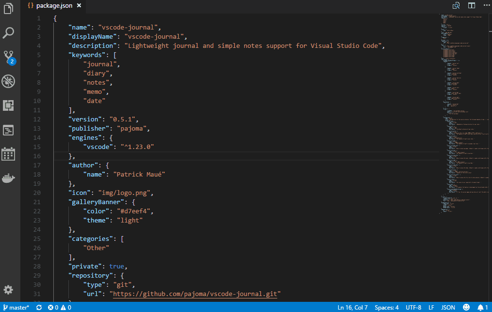

# Working with tasks



Tasks are modelled as checkpoints in your journal entries, e.g. 

```markdown
# Sunday, 2018/06/03

- [ ] Task: Fill out my taxes
- [x] Task: Finish the exercise 
```

You can enter tasks either manually or by the journal smart input (using `Ctrl+Shift+J`). The following examples work for the smart input: 

* `task Fill out my taxes` adds a task to today's entry
* `task 06-24 Call my mom` adds a task for entry of June 24th
* `task +1 Call my mom` adds a task for entry for tomorrow
* `task tom Call my mom` adds a task for entry for tomorrow
* `task next friday Call my mom` adds a task for entry for next friday


